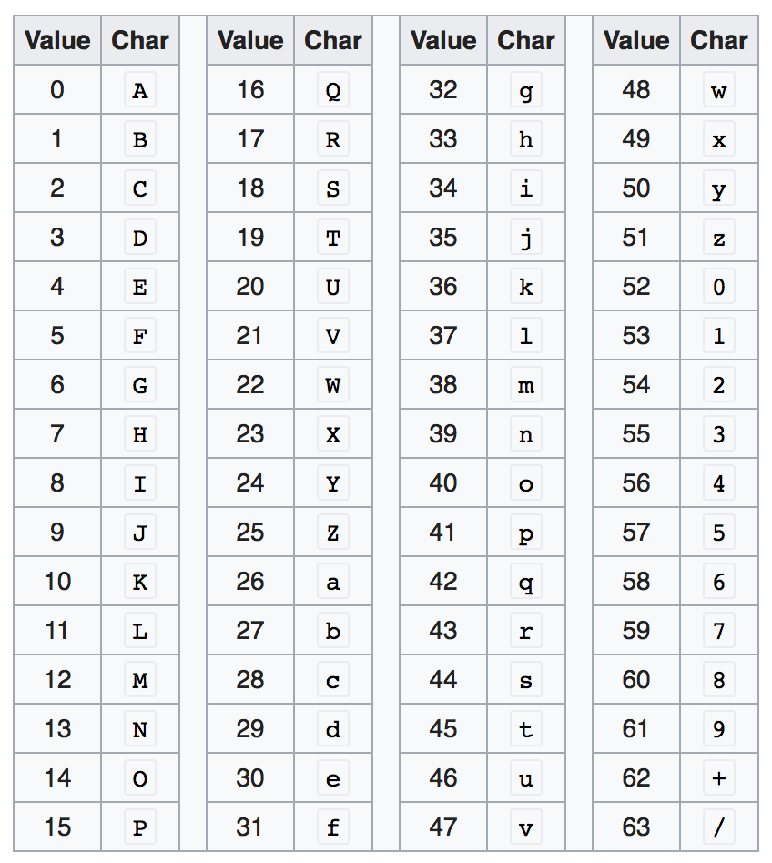
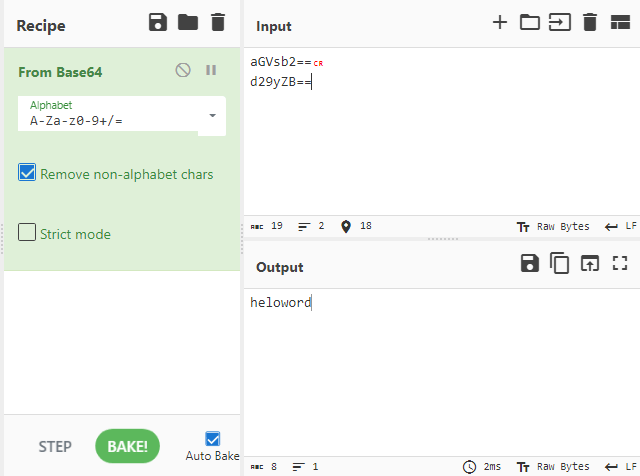
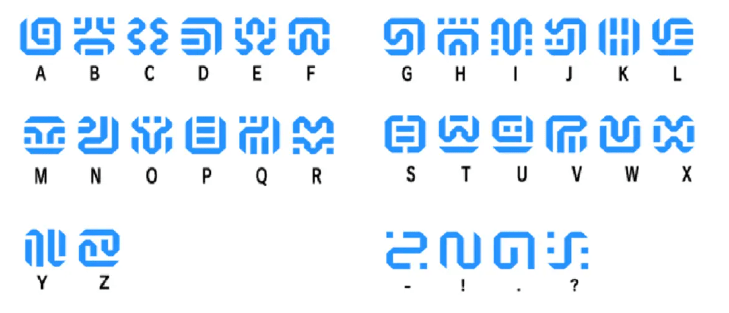
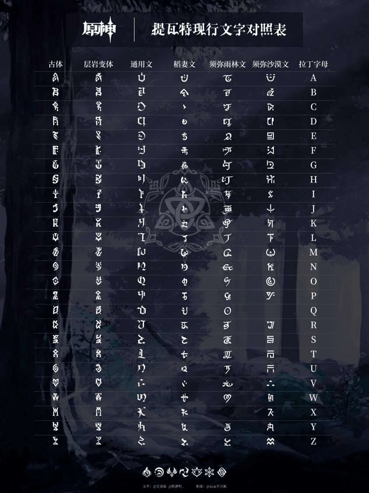
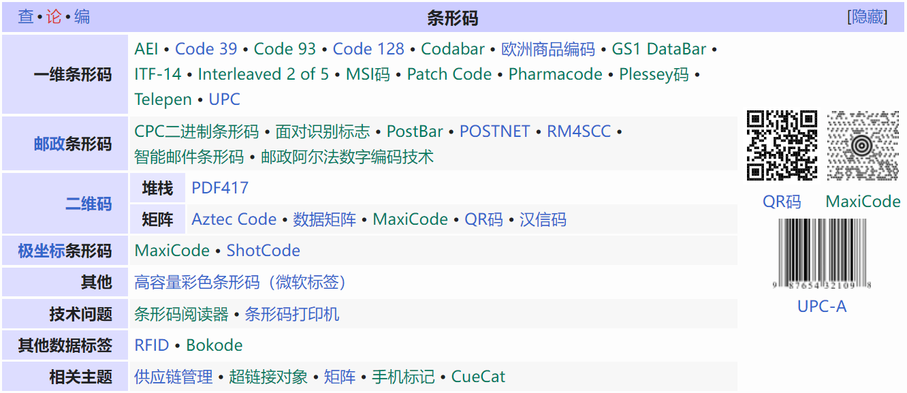
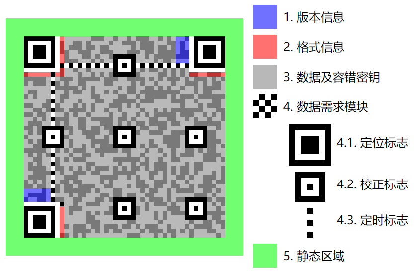
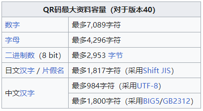
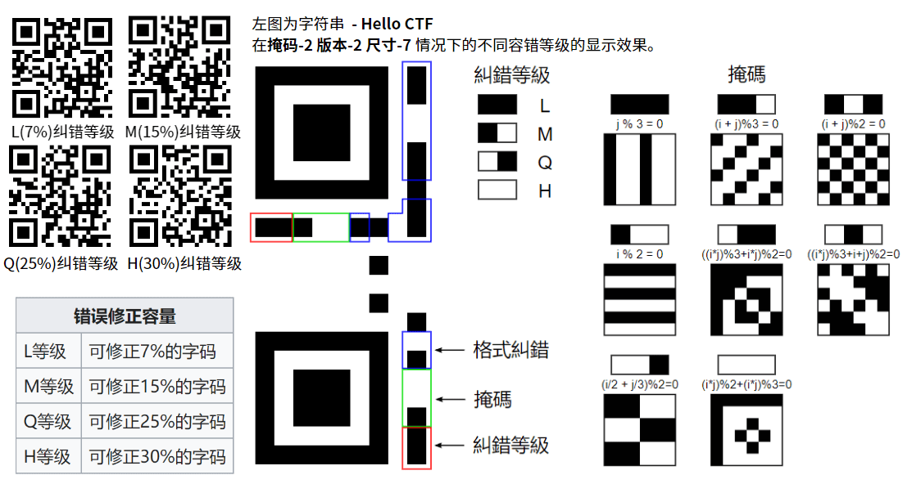

## 编码扩展

> 注意，阅读本篇之前，您需要先阅读 [编码](../HC_Crypto/Encode.md) 章节的内容。

### 简述
在前面我们介绍了编码的基本概念，以及常见的编码方式，但在MISC这个脑洞大开，千奇百怪的分区下，显然基础的编码知识是不够用的，在这个板块我们会做以下补充：

- 进制与BASE家族的脚本扩展
- 现代受一些 **不可抗力因素**  (~~指河蟹,一种居住于河边的螃蟹~~) 以及 **各类文化元素** / **游戏** (~~塞尔达，启动！~~) / **甚至是抽象梗** 的影响产生的 **编码** 或 **类密码编码** (如：社会主义核心价值观编码，兽语，DNA编码，与佛论禅，希卡文，提瓦特大陆文字，阴阳怪气编码，真嘟假嘟编码....)
- 代码混淆
- 图片码  (如：条形码，二维码）

### 进制

>**进位制** 又称 **进制** ，是一种[记数方式](https://zh.wikipedia.org/wiki/记数系统)，亦称 **位置记法** （positional notation）、 **数字命位法** [[1\]](https://zh.wikipedia.org/wiki/进位制#cite_note-1)、**定位记法** [[2\]](https://zh.wikipedia.org/wiki/进位制#cite_note-2)、**进位记数法**、**位值记数法**（place-value notation）、**位置数值系统**（positional numeral system）；利用这种“[记数法](https://zh.wikipedia.org/wiki/记数法)”，可以使用有限种“[数字](https://zh.wikipedia.org/wiki/數字)符号”来表示所有的数值。
>
>—— [中文wiki——进位制](https://zh.wikipedia.org/wiki/%E8%BF%9B%E4%BD%8D%E5%88%B6)

#### 二进制

在MISC中，针对二进制的脑洞是比较多的，二进制由 `0` 和 `1` 组成：

- 【脑洞联想】两种状态的表示很容易联系到其他编码 如 **摩尔斯电码**（~~还有黑丝白丝（？~~），**二维码** ( 两种色块 )；再进一步，黑白色块或者黑白两种颜色的图片排布等等。
- 【数据表示】作为计算机领域最底层的基础，二进制与数据转换和表示密切相关，比如 字符可以通过ASCII码表转换成对应 `x` 位二进制。
- 【古今结合】二进制与中国的太极 八卦等古代思想有很大相似之处。（如：[[LitCTF 2023]两仪生四象](https://www.nssctf.cn/problem/3885)）

#### 十六进制


### BASE 家族扩展

考虑到MISC板块的特性——选手需要一定的脚本写作能力，所以我们在这里对base家族做一些扩展：

- 使用python完成base64 encode/decode

- 非标准（换表）base64

- base64隐写

#### 编码解码

在编码部分我们其实已经介绍过了base家族的一些知识，并且拿Base64来举例说明了编码过程，下面是python原生编码解码的示例。

```python
class CustomBase64:

    CHAR_SET = "ABCDEFGHIJKLMNOPQRSTUVWXYZabcdefghijklmnopqrstuvwxyz0!@#$%^&*()-"

    @classmethod
    def encode(cls, s: str) -> str:
        binary_str = ''.join(format(ord(c), '08b') for c in s)  # 转化为二进制字符串
        padding = 3 - (len(s) % 3) if len(s) % 3 else 0  # 计算需要的填充
        binary_str += '0' * (padding * 8)

        index_strs = [binary_str[i:i + 6] for i in range(0, len(binary_str), 6)]
        encoded = ''.join(cls.CHAR_SET[int(index_str, 2)] for index_str in index_strs)

        return encoded[:-padding] + "=" * padding  # 添加填充

    @classmethod
    def decode(cls, s: str) -> str:
        padding = s.count('=')
        s = s.rstrip('=')

        binary_str = ''.join(format(cls.CHAR_SET.index(c), '06b') for c in s)  # 转化为二进制字符串
        byte_strs = [binary_str[i:i + 8] for i in range(0, len(binary_str), 8)][:-padding]

        decoded = ''.join(chr(int(byte_str, 2)) for byte_str in byte_strs)

        return decoded
```

在python中可以直接使用base64包对base家族进行encode和decode操作，比如密文 `U3F1ZGd5IGZleiwgYmxhbmsgamltcCBjcnd0aCB2b3g=`

```python
C:\Users\Probius>python
Python 3.8.1 (tags/v3.8.1:1b293b6, Dec 18 2019, 23:11:46) [MSC v.1916 64 bit (AMD64)] on win32
Type "help", "copyright", "credits" or "license" for more information.
>>> import base64
>>> print(base64.b64decode("U3F1ZGd5IGZleiwgYmxhbmsgamltcCBjcnd0aCB2b3g="))
b'Squdgy fez, blank jimp crwth vox'
>>>
```

当然，这种过程，平时交给工具就好了，如果有考点主要还是在base64换表上（写到这笔者想起当时刚入门CTF的时候base64换表都还算比较热门的考点来着，#现在好像见不到了）。

#### Base64 换表

通过阅读 **编码** 章节中base64的编码解码过程，其实 **换表** 不难理解。

base64有多个表，常用的标准表为 `ABCDEFGHIJKLMNOPQRSTUVWXYZabcdefghijklmnopqrstuvwxyz0123456789+/` 不过，如果不考虑base64使用需求，我们可以打乱这个表，也可以用另外的标准ASCII字符来替换这个表，只要满足表中有64个标准元素即可。

比如 已知密文“ `SGVsbG*sIFdvcmxkIQ==` ”，自定义表“ `ABCDEFGHIJKLMNOPQRSTUVWXYZabcdefghijklmnopqrstuvwxyz0!@#$%^&*()-` ”，如何求原文呢？

```python
C:\Users\Probius>python
Python 3.8.1 (tags/v3.8.1:1b293b6, Dec 18 2019, 23:11:46) [MSC v.1916 64 bit (AMD64)] on win32
Type "help", "copyright", "credits" or "license" for more information.
>>> import base64
>>> print(base64.b64decode("SGVsbG*sIFdvcmxkIQ==".translate(str.maketrans("ABCDEFGHIJKLMNOPQRSTUVWXYZabcdefghijklmnopqrstuvwxyz0!@#$%^&*()-", "ABCDEFGHIJKLMNOPQRSTUVWXYZabcdefghijklmnopqrstuvwxyz0123456789+/"))).decode('utf-8'))
Hello, World!
>>>
```

通常我们使用标准表作为媒介，转换后进行映射即可。

#### Base64 隐写

在前面base64解码过程，我们这样写道：

```
密文： R28=
去掉=：R28
ABCDEFGHIJKLMNOPQRSTUVWXYZabcdefghijklmnopqrstuvwxyz0123456789+/
-----------------↑------------------------------------↑-----↑---
----------------17-----------------------------------54-----60--
对应表位置：              17     54     60 
还原位6位二进制 ：       010001 110110 111100
重新分组为8位二进制：     01000111 01101111 00
8位二进制转换为对应ASCII码：  G        o     /(丢弃不完整部分)
得到原文：Go
```

我们可以看到 后面不足8位的二进制是被丢弃的，而按照base64的编码过程，后面最多留出两个等号即 4个二进制位。

比如我们要将 a 隐藏进字符串 helo 和 word中：

先对他们进行base64编码可以得到：
```
helo -> aGVsbw== 
word -> d29yZA==
```


然后依照表格对应出下标的十进制和二进制：

```
helo -> aGVsbw== -> w 48 -> 110000
word -> d29yZA== -> A 0  -> 000000
```

而对于我们要隐写的a，使用8位二进制表示为 `0110 0001`

下面我们将隐写数据替换到后面4个隐写位置后再查表替换

```
 w 48 -> 110000 -> 110110 -> 54 -> 2
 A 0  -> 000000 -> 000001 -> 1  -> B
```

此时base64编码变更：

```
helo -> aGVsb2==
word -> d29yZB== 
```

可以看到对其解码的结果没有变化，因为==占位的部分会被直接忽略掉。



想要还原他我们只需要将密文base64先解码再编码 得到没有隐写的base64后 与密文比较即可。

```
# |后面部分将被截断
helo -> aGVsbw== 11|0000
helo'-> aGVsb2== 11|0110
offset = 6 (0110) [helo' - helo = 6]
word -> d29yZA== 00|0000
word'-> d29yZB== 00|0001 
offset = 1 (0001) [word - word' = 1]
```

当然也可以使用脚本:

```python
import base64

b64chars = 'ABCDEFGHIJKLMNOPQRSTUVWXYZabcdefghijklmnopqrstuvwxyz0123456789+/'

def decode_steganography(stegb64_list):
    bin_str = ''
    for line in stegb64_list:
        stegb64 = ''.join(line.split())
        
        decoded = base64.b64decode(stegb64)
        rowb64 = base64.b64encode(decoded).decode('utf-8')
        rowb64 = ''.join(rowb64.split())
        
        offset = abs(b64chars.index(stegb64.replace('=', '')[-1]) - b64chars.index(rowb64.replace('=', '')[-1]))
        equalnum = stegb64.count('=')
        
        if equalnum:
            bin_str += bin(offset)[2:].zfill(equalnum * 2)

    return ''.join([chr(int(bin_str[i:i + 8], 2)) for i in range(0, len(bin_str), 8)])

stegb64_list = ['aGVsb2==', 'd29yZB==']
decoded_message = decode_steganography(stegb64_list)
print(decoded_message)
# a
```

### 文本混淆

- 社会主义核心价值观编码 ：https://github.com/sym233/core-values-encoder

- 兽语译者：https://github.com/SycAlright/beast_sdk/

- 与佛论禅：

  源版：https://www.keyfc.net/bbs/tools/tudoucode.aspx

  GitHub开源重制：https://github.com/takuron/talk-with-buddha

- 阴阳怪气编码：https://github.com/mmdjiji/yygq.js

- 尊嘟假嘟编码：https://github.com/YunChenqwq/ZunDuJiaDulanguageTranslator

（一定意义上反映了互联网和misc的抽象发展......）

### 密码类编码

#### DNA编码

idea：https://www.geeksforgeeks.org/dna-protein-python-3/

轮子：https://github.com/karma9874/DNA-Cipher-Script-CTF

#### 希卡文



#### 提瓦特大陆文字



### 代码混淆

原文：`test`

- jsfuck ： `(!![]+[])[+[]]+(!![]+[])[!+[]+!+[]+!+[]]+(![]+[])[!+[]+!+[]+!+[]]+(!![]+[])[+[]]`

- Brainfuck ：`+++++ +++++ [->++ +++++ +++<] >++++ +++++ +++++ ++.<+ ++[-> ---<] >---- --.<+ ++[-> +++<] >++++ +.+.<` 

- JJEncode ：

  ```
  _=~[];_={___:++_,$$$$:(![]+"")[_],__$:++_,$_$_:(![]+"")[_],_$_:++_,$_$$:({}+"")[_],$$_$:(_[_]+"")[_],_$$:++_,$$$_:(!""+"")[_],$__:++_,$_$:++_,$$__:({}+"")[_],$$_:++_,$$$:++_,$___:++_,$__$:++_};_.$_=(_.$_=_+"")[_.$_$]+(_._$=_.$_[_.__$])+(_.$$=(_.$+"")[_.__$])+((!_)+"")[_._$$]+(_.__=_.$_[_.$$_])+(_.$=(!""+"")[_.__$])+(_._=(!""+"")[_._$_])+_.$_[_.$_$]+_.__+_._$+_.$;_.$$=_.$+(!""+"")[_._$$]+_.__+_._+_.$+_.$$;_.$=(_.___)[_.$_][_.$_];_.$(_.$(_.$$+"\""+_.__+_.$$$_+"\\"+_.__$+_.$$_+_._$$+_.__+"\"")())();
  ```

- AAEncode

  ```
  ﾟωﾟﾉ= /｀ｍ´）ﾉ ~┻━┻   //*´∇｀*/ ['_']; o=(ﾟｰﾟ)  =_=3; c=(ﾟΘﾟ) =(ﾟｰﾟ)-(ﾟｰﾟ); (ﾟДﾟ) =(ﾟΘﾟ)= (o^_^o)/ (o^_^o);(ﾟДﾟ)={ﾟΘﾟ: '_' ,ﾟωﾟﾉ : ((ﾟωﾟﾉ==3) +'_') [ﾟΘﾟ] ,ﾟｰﾟﾉ :(ﾟωﾟﾉ+ '_')[o^_^o -(ﾟΘﾟ)] ,ﾟДﾟﾉ:((ﾟｰﾟ==3) +'_')[ﾟｰﾟ] }; (ﾟДﾟ) [ﾟΘﾟ] =((ﾟωﾟﾉ==3) +'_') [c^_^o];(ﾟДﾟ) ['c'] = ((ﾟДﾟ)+'_') [ (ﾟｰﾟ)+(ﾟｰﾟ)-(ﾟΘﾟ) ];(ﾟДﾟ) ['o'] = ((ﾟДﾟ)+'_') [ﾟΘﾟ];(ﾟoﾟ)=(ﾟДﾟ) ['c']+(ﾟДﾟ) ['o']+(ﾟωﾟﾉ +'_')[ﾟΘﾟ]+ ((ﾟωﾟﾉ==3) +'_') [ﾟｰﾟ] + ((ﾟДﾟ) +'_') [(ﾟｰﾟ)+(ﾟｰﾟ)]+ ((ﾟｰﾟ==3) +'_') [ﾟΘﾟ]+((ﾟｰﾟ==3) +'_') [(ﾟｰﾟ) - (ﾟΘﾟ)]+(ﾟДﾟ) ['c']+((ﾟДﾟ)+'_') [(ﾟｰﾟ)+(ﾟｰﾟ)]+ (ﾟДﾟ) ['o']+((ﾟｰﾟ==3) +'_') [ﾟΘﾟ];(ﾟДﾟ) ['_'] =(o^_^o) [ﾟoﾟ] [ﾟoﾟ];(ﾟεﾟ)=((ﾟｰﾟ==3) +'_') [ﾟΘﾟ]+ (ﾟДﾟ) .ﾟДﾟﾉ+((ﾟДﾟ)+'_') [(ﾟｰﾟ) + (ﾟｰﾟ)]+((ﾟｰﾟ==3) +'_') [o^_^o -ﾟΘﾟ]+((ﾟｰﾟ==3) +'_') [ﾟΘﾟ]+ (ﾟωﾟﾉ +'_') [ﾟΘﾟ]; (ﾟｰﾟ)+=(ﾟΘﾟ); (ﾟДﾟ)[ﾟεﾟ]='\\'; (ﾟДﾟ).ﾟΘﾟﾉ=(ﾟДﾟ+ ﾟｰﾟ)[o^_^o -(ﾟΘﾟ)];(oﾟｰﾟo)=(ﾟωﾟﾉ +'_')[c^_^o];(ﾟДﾟ) [ﾟoﾟ]='\"';(ﾟДﾟ) ['_'] ( (ﾟДﾟ) ['_'] (ﾟεﾟ+(ﾟДﾟ)[ﾟoﾟ]+ (ﾟДﾟ)[ﾟεﾟ]+(ﾟΘﾟ)+ ((o^_^o) +(o^_^o))+ (ﾟｰﾟ)+ (ﾟДﾟ)[ﾟεﾟ]+(ﾟΘﾟ)+ (ﾟｰﾟ)+ ((ﾟｰﾟ) + (ﾟΘﾟ))+ (ﾟДﾟ)[ﾟεﾟ]+(ﾟΘﾟ)+ ((o^_^o) +(o^_^o))+ (o^_^o)+ (ﾟДﾟ)[ﾟεﾟ]+(ﾟΘﾟ)+ ((o^_^o) +(o^_^o))+ (ﾟｰﾟ)+ (ﾟДﾟ)[ﾟoﾟ]) (ﾟΘﾟ)) ('_');
  ```

### 图片码

> 图：[中文wiki-条形码](https://zh.wikipedia.org/zh-cn/%E6%9D%A1%E5%BD%A2%E7%A0%81)

图片码通过维度来区分，可以分为 **「 线性/一维 条形码  Barcode 」** 和 **「 矩阵/二维 条形码  Matrix (2D) barcodes 」** ,网络上对于两类条形码的分类标准有些杂乱，在国内，**二维码** 多指 [**QR code**](https://en.wikipedia.org/wiki/QR_code) ，多数情况下均为狭义指代，并不指代广义上的 **「 矩阵/二维 条形码 」** 。读者要是感兴趣可以阅读  **[英文wiki - Barcode](https://en.wikipedia.org/wiki/Barcode)**。

本文会沿用国内的解释风格，重点介绍二维码。

#### 条形码

> **「 条形码 / 条码 Barcode」** ，是将宽度不等的多个黑条和空白，按照一定的[编码](https://zh.wikipedia.org/wiki/编码)规则排列，用以表达一组[信息](https://zh.wikipedia.org/wiki/信息)的图形标识符。

作为最先出世的图形码，条形码在国际上已有一个庞大的标准库，在CTF中出现的频率并不高，同编码一样，搜索引擎能够解决大部分问题。读者无需刻意记忆。

#### 二维码

> **二维码** 也称为 **二维条码**、**行动条码**，是指在[一维条码](https://zh.wikipedia.org/wiki/一维条码)的基础上扩展出另一[维](https://zh.wikipedia.org/wiki/维度)具有可读性的条码，大多数使用黑白矩形图案表示[二进制](https://zh.wikipedia.org/wiki/二进制)数据，也有一些使用其他形状（[MaxiCode]()），或在黑白色二维码基础上使用颜色作为第三维度的种类（[JAB Code]()），被设备扫描后可获取其中所包含的信息。二维码的种类很多，不同的机构开发出的二维码具有不同的结构以及编写、读取方法。常见的二维码有：
>
> - [PDF417码](https://zh.wikipedia.org/wiki/PDF417码)
> - [QR码](https://zh.wikipedia.org/wiki/QR码)
> - [汉信码](https://zh.wikipedia.org/wiki/汉信码)
> - [Aztec码](https://zh.wikipedia.org/wiki/Aztec码)
> - [Data Matrix](https://zh.wikipedia.org/wiki/Data_Matrix)

在国内，二维码通常指代QR码。

二维码在MISC中占比比较重，通常会结合其他知识点一同考察（包括隐写取证）。

**结构**

QR码最大特征为其左上，右上，左下三个大型的如同“回”字的黑白间同心方图案，为QR码识别定位标记，失去其中一个会影响识别。



**二维码存储** 

QR码一共提供40种不同版本存储密度的结构，对应指示图的“版本信息”，版本1为 **21×21** 模块（模块为QR码中的最小单元），**每增加一个版本，长宽各增加4个模块**，最大的版本40为177×177模块。



**容错修正**

QR码有容错能力，即使图形破损仍然可以读取，破损面积最高可达30%。相对而言，QR码图形面积愈大，容错率愈高，所以一般折衷使用15%容错能力（M等级）。



在CTF中，二维码通常涉及的考察点有：

- 二进制转二维码

  ```python
  from PIL import Image
  
  def generate_qrcode_from_binary(binary_str, img_size):
  
      assert len(binary_str) == img_size[0] * img_size[1], "Size mismatch!"
  
      pic = Image.new("RGB", img_size, color="white")
      index = 0
      for y in range(img_size[1]):
          for x in range(img_size[0]):
              if binary_str[index] == '1':
                  pic.putpixel([x, y], (0, 0, 0))
              index += 1
      return pic
  
  # 示例二进制数据
  binary_data = "1111111000100001101111111100000101110010110100000110111010100000000010111011011101001000000001011101101110101110110100101110110000010101011011010000011111111010101010101111111000000001011101110000000011010011000001010011101101111010101001000011100000000000101000000001001001101000100111001111011100111100001110111110001100101000110011100001010100011010001111010110000010100010110000011011101100100001110011100100001011111110100000000110101001000111101111111011100001101011011100000100001100110001111010111010001101001111100001011101011000111010011100101110100100111011011000110000010110001101000110001111111011010110111011011"  
  
  img_size = (25, 25)
  qrcode = generate_qrcode_from_binary(binary_data, img_size)
  qrcode.show()
  qrcode.save("flag.png")
  ```

- 二维码修复
- 二维码拼接

使用到的工具：

- https://merri.cx/qrazybox/
- QR_Research
