## 前言

> 版权声明：
>
> ​	文档源于项目[ProbiusOfficial/CTF-QuickStart: 针对0基础新手编写的CTF快速入门手册 (github.com)](https://github.com/ProbiusOfficial/CTF-QuickStart)
>
> ​	原作者为 白猫 ，橘墨基于 [Notion - ctf-archives](https://www.notion.so/ctf-archives) 和 [Forensics wiki ](https://www.forensics-wiki.com)进行补充

内存取证在ctf比赛中也是常见的题目，内存取证是指在计算机系统的内存中进行取证分析，以获取有关计算机系统当前状态的信息。内存取证通常用于分析计算机系统上运行的进程、网络连接、文件、注册表等信息，并可以用于检测和分析恶意软件、网络攻击和其他安全事件

对于ctf比赛中所接触到的内存取证，选手大多拿到的都是已经提取好的内存镜像文件，也就是内存数据的原始完整拷贝，这已经从开局就大大简化了内存取证的难度，并不需要选手去考虑如何获取内存数据的完整镜像。而选手接下来所要面对的，就是对内存数据进行解析。对于内存数据，最为常用的工具便是 `Volatility Framework` ，其为 `Volatility Foundation` 所开发的一款对内存取证分析提供支持的框架，对多平台电子设备的内存数据均提供了支持，并且也支持加载第三方模块来增加功能。

!!! Tip "小窍门"   
    虽说内存取证最为优雅的解法就是利用 `Volatility Framework` ，但是都戏称：“内存取证的终点是 strings + grep ”。因为由于内存其本身就为操作系统和软件运行时的动态数据，所以绝大多数的数据都是直接以明文形式储存在内存之中的，往往直接 strings 进行提取明文字符串并加以筛选，就能获得一些意想不到的惊喜

## 工具安装

### Python2&3与pip安装方法

首先就是安装Python和pip，在kali和一些linux发行版上，python都是自带的，但是需要注意的是，在新版本Ubuntu中，已经移除了Python2的预装。Python和pip安装方法如下：

```
sudo apt-get update  #更新源
sudo apt-get install python2   #安装python2
sudo apt-get install python-pip2   #安装pip2
sudo apt-get install python3-pip   #安装pip3
```

需要注意的是，在 `Debian` 系的系统（如 `Ubuntu` 或者 `Kali` ）中，默认的软件包管理器`apt`会将`pip2`和`pip3`识别为相互冲突的两个软件包，所以只是用`apt`是无法同时安装`pip2`和`pip3`两个软件包的。由于`Volatility2`依赖于`Python2`，而`Volatility3`依赖于`Python3`，所以两个版本的`pip`都需要安装

建议`python3-pip`直接通过`apt`安装，而`python2`的`pip`通过以下方式进行安装：

```shell
wget https://bootstrap.pypa.io/pip/2.7/get-pip.py
sudo python2 get-pip.py
```

### 下载和安装Volatility2

Volatility是一款开源的内存分析框架，主要用于从计算机内存中提取数字证据。它可以用于取证、恶意代码分析、漏洞研究、操作系统学习以及其他安全领域

当前，Volatility 已经开发到了Volatility 3，但是第三代仍然在开发阶段，其功能相较于第二代还不完善，但是第三代对Windows 10以上的Windows系统所导出的内存数据提供了更完善的支持，并实现了更快的分析速度，故建议进行内存取证工作的时候，两代Volatility 都备着（反正只是一个工具，相较于检材动辄大几G而言，完全不算大）。

Volatility2项目地址：

```
https://github.com/volatilityfoundation/volatility
```

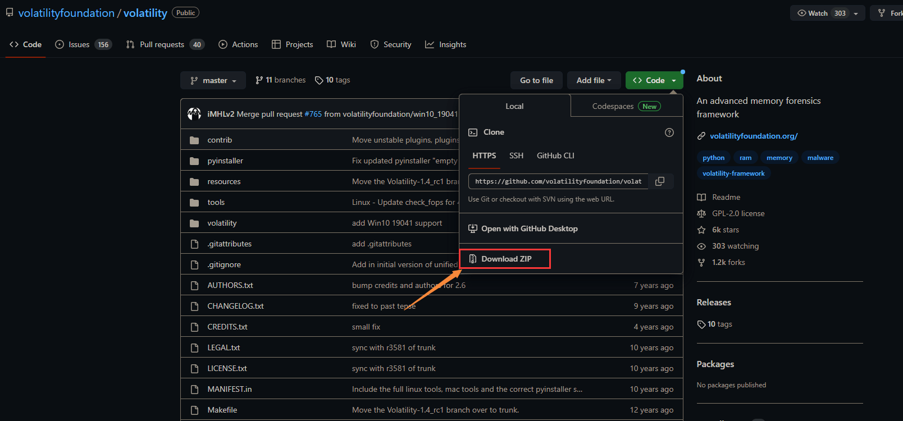

如果你在国外的话，可以直接运行这个命令来获取Volatility项目

```
apt install git
git clone https://github.com/volatilityfoundation/volatility.git
```

在国内用这个命令的话，下载非常慢，建议直接从官方的Github仓库获取下来Vol2 的完整源码，直接Download ZIP即可：


从压缩包里提取文件

```
unzip [file_name] -d [destination]  #filename：你要提取的压缩包名称，destination：提取后的文件存放位置
```

进入文件夹，运行以下命令即可安装

```
python2 setup.py install
```

### 下载和安装Volatility3

!!! Warning "一些环境问题"   
    本人建议这类环境是基于`Linux`（本人推荐`Ubuntu`），使用`Windows`来开展工作也可以，那么`Volatility 3`使用pip直接安装。另外需要注意的是，`Volatility 3`在`Windows`的`cmd`中无法执行，因为`Volatility 3`所绑定的指令是`vol`，这与`cmd`中自带的指令发生冲突（`vol` in cmd：显示磁盘卷标和序列号(如果存在)），故如果要在`Windows`环境中使用`Volatility 3`，需要使用非`cmd`终端（例如`Powershell`）

相较于Vol 2要通过源码来编译安装，Vol 3的安装则更为人性化：直接通过pip来安装：

```shell
pip3 install volatility3
```

!!! Warning "2&3"   
    需要注意的是，Linux系统中，允许Python2与Python3环境并存，但是二者的依赖库（python-dev）和第三方包（通过pip包管理器安装的第三方包）并不会共享，也就意味着如果如上文安装好Vol 2之后，相关操作也要再重复一遍    

### 依赖安装

如果不安装依赖，Volatility很多功能都用不了

首先需要安装Python2的相关编译依赖库

```shell
sudo apt install python2-dev
```

然后安装pip相关包：

```
pip2 install pycryptodome -i https://pypi.tuna.tsinghua.edu.cn/simple
pip2 install yara -i https://pypi.tuna.tsinghua.edu.cn/simple
pip2 install distorm3 -i https://pypi.tuna.tsinghua.edu.cn/simple
```

### Volatility加载插件

mimikatz脚本文件下载地址

```
链接：https://pan.baidu.com/s/1HS65N4UXfuzChB9UU9vveA 
提取码：fywk 
```

然后将这个脚本文件移动到/volatility/plugins目录下

```
mv mimkatz.py /volatility/plugins/
```


然后安装construct库

```
sudo pip2 install construct==2.5.5-reupload
```

## 演示题目的下载地址

本片文章使用的案例：

```
链接：https://pan.baidu.com/s/1nD-svI98v3yQPPKT0HyEjg 
提取码：0dnx 
```

## 工具的使用方法

### 获取内存镜像详细信息

imageinfo是Volatility中用于获取内存镜像信息的命令。它可以用于确定内存镜像的操作系统类型、版本、架构等信息，以及确定应该使用哪个插件进行内存分析

```
python2 vol.py -f Challenge.raw imageinfo  #f：指定分析的内存镜像文件名
```


```
上述输出中，Suggested Profile(s) 显示了 Volatility 推荐的几个内存镜像分析配置文件，可以根据这些配置文件来选择合适的插件进行内存分析
AS Layer2 显示了使用的内存镜像文件路径
KDBG 显示了内存镜像中的 KDBG 结构地址
Number of Processors 显示了处理器数量
Image Type 显示了操作系统服务包版本
Image date and time 显示了内存镜像文件的创建日期和时间
```

### 获取正在运行的程序

这里我们用Win7SP1x64配置文件进行分析，Volatility 的 pslist 插件可以遍历内存镜像中的进程列表，显示每个进程的进程 ID、名称、父进程 ID、创建时间、退出时间和路径等信息

```
python2 vol.py -f Challenge.raw --profile=Win7SP1x64 pslist
```

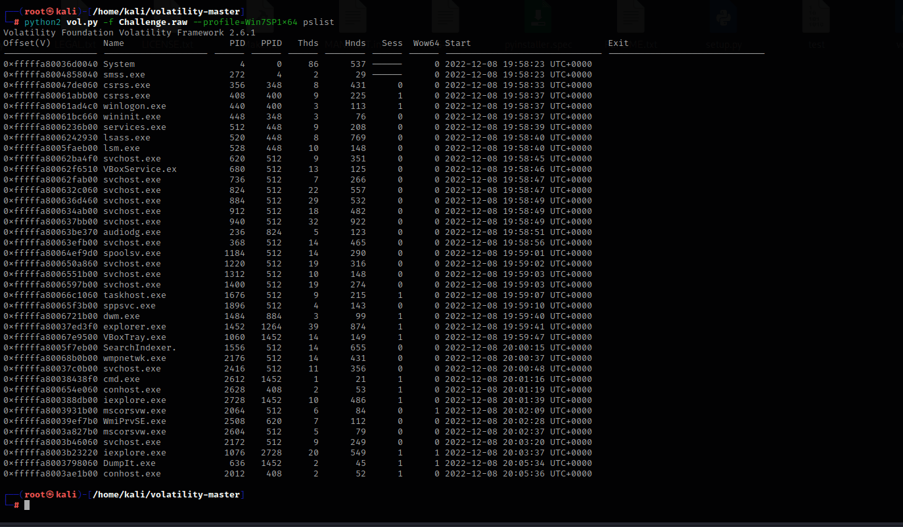

### 提取正在运行的程序

Volatility 的 procdump 插件可以根据进程 ID 或进程名称提取进程的内存映像，并保存为一个单独的文件

比如这里我要提取iexplore.exe这个程序


他的进程pid号为2728

```
python2 vol.py -f Challenge.raw --profile=Win7SP1x64 procdump -p 2728 -D ./
p：pid进程号
D：提取程序后保存的地址，./指的是当前shell正在运行的文件夹地址，输入pwd命令可以查看shell当前的地址，简单来说就是保存到当前文件夹
```


成功导出，导出后文件名为executable.2728.exe


### 查看在终端里执行过的命令

Volatility 的 cmdscan 插件可以扫描内存镜像中的进程对象，提取已执行的 cmd 命令，并将其显示在终端中

```
python2 vol.py -f Challenge.raw --profile=Win7SP1x64 cmdscan
```


他移动到了Documents目录下，echo了一次字符串，然后创建了一个名为hint.txt的文件

### 查看进程在终端里运行的命令

Volatility中的cmdline插件可以用于提取进程执行的命令行参数和参数值

```
python2 vol.py -f Challenge.raw --profile=Win7SP1x64 cmdline
```

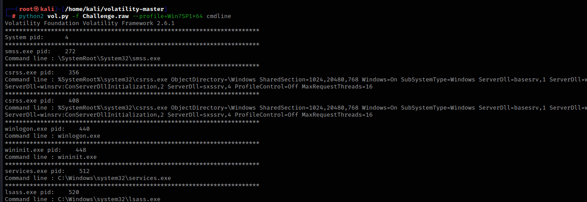


### 查找内存中的文件

Volatility 的 filescan插件可以在内存中搜索已经打开的文件句柄，从而获取文件名、路径、文件大小等信息

我想找到hint.txt文件，可以使用以下命令

```
python2 vol.py -f Challenge.raw --profile=Win7SP1x64 filescan | grep hint.txt
```


grep是Linux下常用的命令之一，它用于在文件中查找指定的字符串，并将包含该字符串的行输出

如果只使用filescan而不配合grep的话，Volatility就会输出系统上的全部文件，例如：


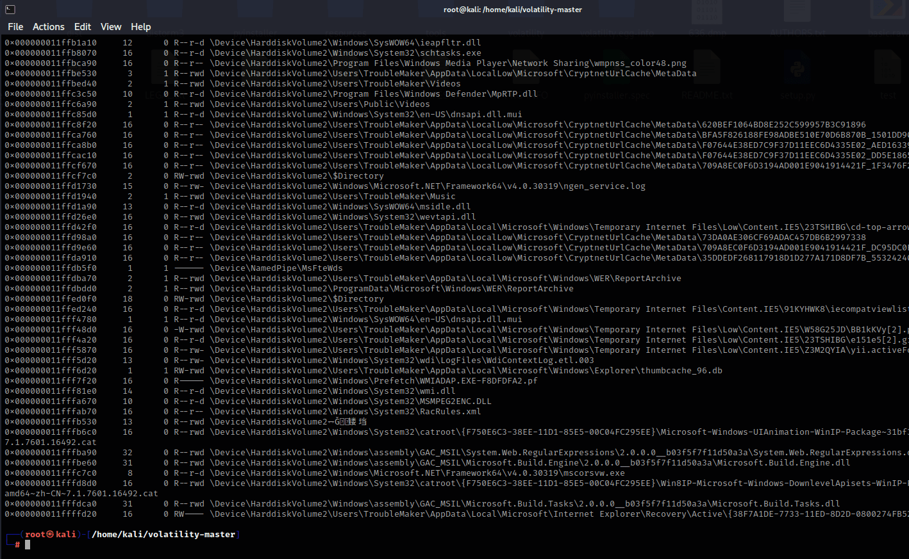

### 提取内存中的文件

Volatility的dumpfiles插件可以用来提取系统内存中的文件


这里我要提取hint.txt文件，hint.txt的内存位置为0x000000011fd0ca70，这两个由于位置都一样，随便提取哪个都行

```
python2 vol.py -f Challenge.raw --profile=Win7SP1x64 dumpfiles -Q 0x000000011fd0ca70 -D ./
Q：内存位置
D：提取程序后保存的地址，./指的是当前shell正在运行的文件夹地址，输入pwd命令可以查看shell当前的地址，简单来说就是保存到当前文件夹
```


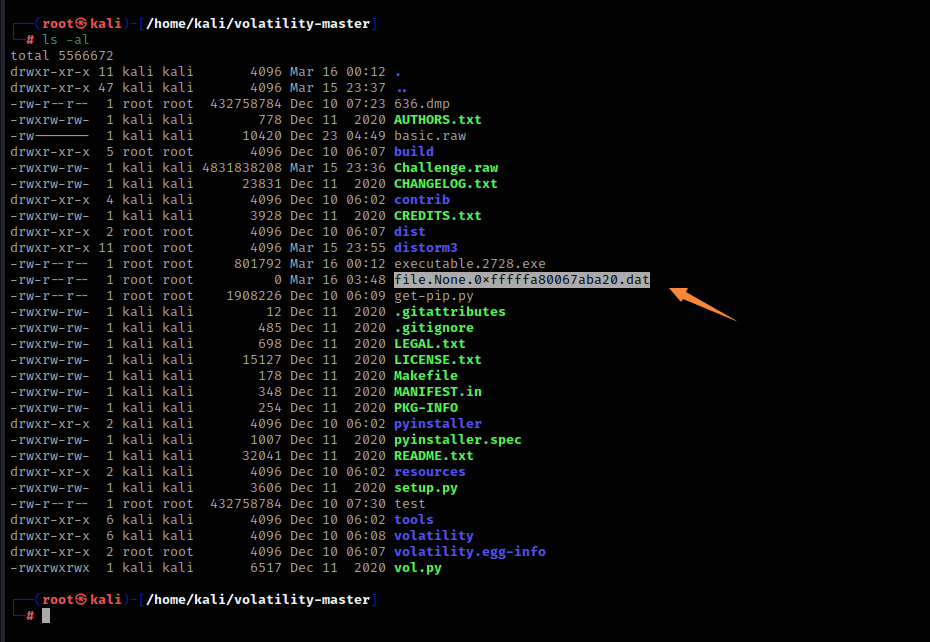

提取出来的文件名是包含内存地址的，更改一下后缀名即可运行

### 查看浏览器历史记录

Volatility中的iehistory插件可以用于提取Internet Explorer浏览器历史记录

```
python2 vol.py -f Challenge.raw --profile=Win7SP1x64 iehistory
```


### 提取用户密码hash值并爆破

Volatility中的Hashdump插件可以用于提取系统内存中的密码哈希值

```
python2 vol.py -f Challenge.raw --profile=Win7SP1x64 hashdump
```


这里提取了四个用户的密码hash值，我们将这些字符串复制一下，粘贴到本地本文里

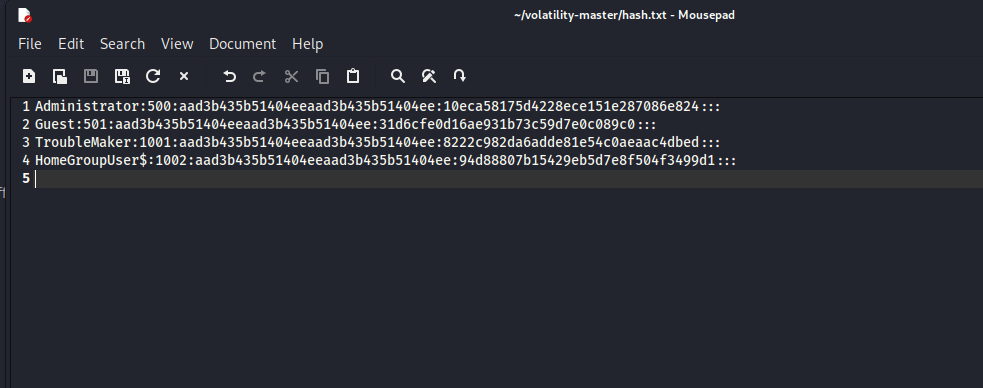

我们可以使用这个在线网站：

```
https://crackstation.net/
```

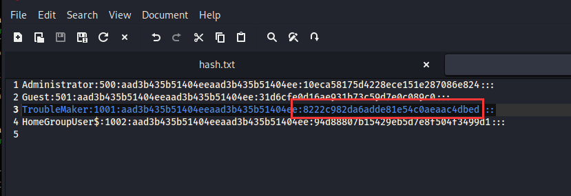


将hash值粘贴上去

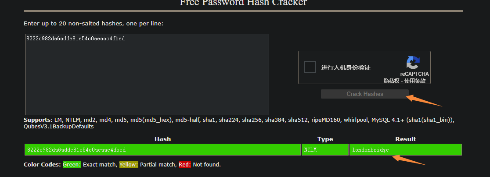

就可以得到用户密码明文

### 使用mimikatz提取密码

mimikatz是一个开源的用于从Windows操作系统中提取明文密码，哈希值以及其他安全凭据的工具

```
python2 vol.py -f Challenge.raw --profile=Win7SP1x64 mimikatz
```


成功提取到TroubleMaker用户的密码

### 查看剪切板里的内容

Volatility中的clipboard插件可以用于从内存转储中提取剪贴板数据

```
python2 vol.py -f Challenge.raw --profile=Win7SP1x64 clipboard
```


### 查看正在运行的服务

svcscan是Volatility中的一个插件，用于扫描进程中所有的服务

```
svcscan
```

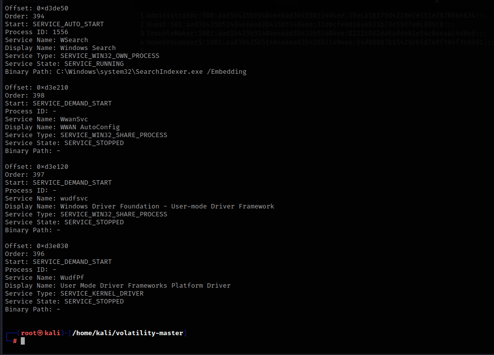

执行了svcscan之后，每列代表服务的一些信息，包括服务名、PID、服务状态、服务类型、路径等等

### 查看网络连接状态

Volatility中的netscan插件可以在内存转储中查找打开的网络连接和套接字，该命令将显示所有当前打开的网络连接和套接字。输出包括本地和远程地址、端口、进程ID和进程名称等信息

```
python2 vol.py -f Challenge.raw --profile=Win7SP1x64 netscan
```

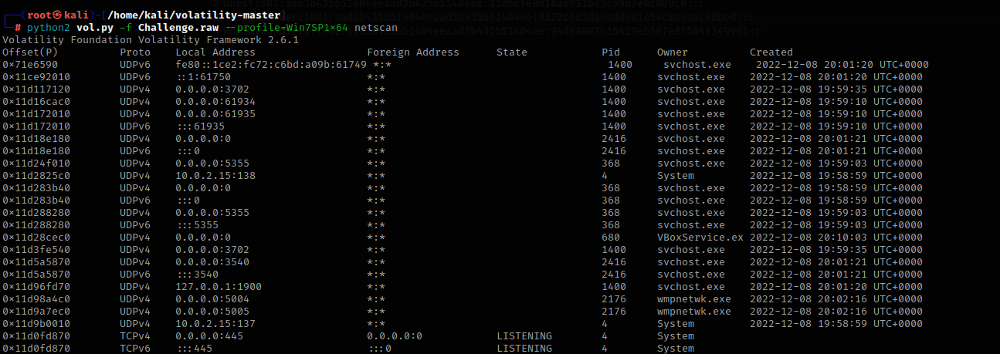

### 查看注册表信息

printkey是Volatility工具中用于查看注册表的插件之一。它可以帮助分析人员查看和解析注册表中的键值，并提供有关键值的详细信息，如名称、数据类型、大小和值等

```
python2 vol.py -f Challenge.raw --profile=Win7SP1x64 printkey
```

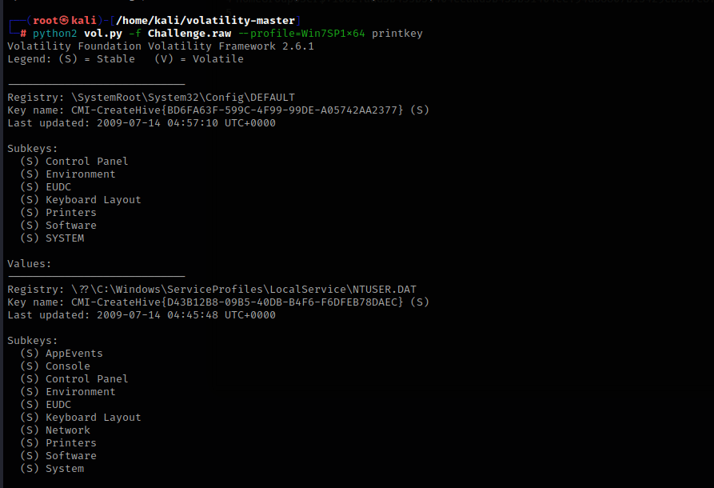


然后使用hivelist插件来确定注册表的地址

```
python2 vol.py -f Challenge.raw --profile=Win7SP1x64 hivelist
```


查看注册表software项

hivedump是一个Volatility插件，用于从内存中提取Windows注册表的内容，这里我们选择第一个来演示

```
python2 vol.py -f Challenge.raw --profile=Win7SP1x64 hivedump -o 0xfffff8a00127d010
o：hivelist列出的Virtual值
```

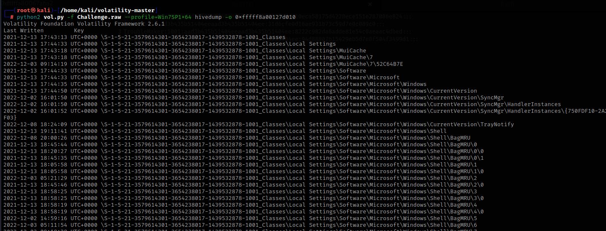

根据名称查看具体子项的内容，这里以SAM\Domains\Account\Users\Names做演示，这个是Windows系统中存储本地用户账户信息的注册表路径，它包含了每个本地用户账户的名称和对应的SID信息

```
python2 vol.py -f Challenge.raw --profile=Win7SP1x64 printkey -K "SAM\Domains\Account\Users\Names"
```

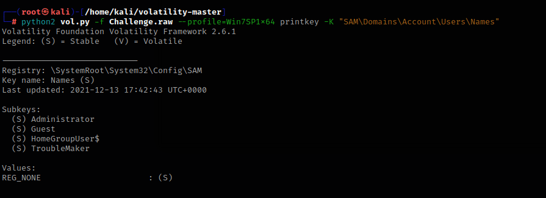

如果要提取全部的注册表，可以用这个命令

```
python2 vol.py -f Challenge.raw --profile=Win7SP1x64 dumpregistry -D ./
```


### 全部插件

```
amcache        	查看AmCache应用程序痕迹信息
apihooks       	检测内核及进程的内存空间中的API hook
atoms          	列出会话及窗口站atom表
atomscan       	Atom表的池扫描(Pool scanner)
auditpol       	列出注册表HKLMSECURITYPolicyPolAdtEv的审计策略信息
bigpools       	使用BigPagePoolScanner转储大分页池(big page pools)
bioskbd        	从实时模式内存中读取键盘缓冲数据(早期电脑可以读取出BIOS开机密码)
cachedump      	获取内存中缓存的域帐号的密码哈希
callbacks      	打印全系统通知例程
clipboard      	提取Windows剪贴板中的内容
cmdline        	显示进程命令行参数
cmdscan        	提取执行的命令行历史记录（扫描_COMMAND_HISTORY信息）
connections    	打印系统打开的网络连接(仅支持Windows XP 和2003)
connscan       	打印TCP连接信息
consoles       	提取执行的命令行历史记录（扫描_CONSOLE_INFORMATION信息）
crashinfo      	提取崩溃转储信息
deskscan       	tagDESKTOP池扫描(Poolscaner)
devicetree     	显示设备树信息
dlldump        	从进程地址空间转储动态链接库
dlllist        	打印每个进程加载的动态链接库列表
driverirp      	IRP hook驱动检测
drivermodule   	关联驱动对象至内核模块
driverscan     	驱动对象池扫描
dumpcerts      	提取RAS私钥及SSL公钥
dumpfiles      	提取内存中映射或缓存的文件
dumpregistry   	转储内存中注册表信息至磁盘
editbox        	查看Edit编辑控件信息 (Listbox正在实验中)
envars         	显示进程的环境变量
eventhooks     	打印Windows事件hook详细信息
evtlogs        	提取Windows事件日志（仅支持XP/2003)
filescan       	提取文件对象（file objects）池信息
gahti          	转储用户句柄（handle）类型信息
gditimers      	打印已安装的GDI计时器(timers)及回调(callbacks)
gdt            	显示全局描述符表(Global Deor Table)
getservicesids 	获取注册表中的服务名称并返回SID信息
getsids        	打印每个进程的SID信息
handles        	打印每个进程打开的句柄的列表
hashdump       	转储内存中的Windows帐户密码哈希(LM/NTLM)
hibinfo        	转储休眠文件信息
hivedump       	打印注册表配置单元信息
hivelist       	打印注册表配置单元列表
hivescan       	注册表配置单元池扫描
hpakextract    	从HPAK文件（Fast Dump格式）提取物理内存数据
hpakinfo       	查看HPAK文件属性及相关信息
idt            	显示中断描述符表(Interrupt Deor Table)
iehistory      	重建IE缓存及访问历史记录
imagecopy      	将物理地址空间导出原生DD镜像文件
imageinfo      	查看/识别镜像信息
impscan        	扫描对导入函数的调用
joblinks       	打印进程任务链接信息
kdbgscan       	搜索和转储潜在KDBG值
kpcrscan       	搜索和转储潜在KPCR值
ldrmodules     	检测未链接的动态链接DLL
lsadump        	从注册表中提取LSA密钥信息（已解密）
machoinfo      	转储Mach-O 文件格式信息
malfind        	查找隐藏的和插入的代码
mbrparser      	扫描并解析潜在的主引导记录(MBR)
memdump        	转储进程的可寻址内存
memmap         	打印内存映射
messagehooks   	桌面和窗口消息钩子的线程列表
mftparser      	扫描并解析潜在的MFT条目
moddump        	转储内核驱动程序到可执行文件的示例
modscan        	内核模块池扫描
modules        	打印加载模块的列表
multiscan      	批量扫描各种对象
mutantscan     	对互斥对象池扫描
notepad        	查看记事本当前显示的文本
objtypescan    	扫描窗口对象类型对象
patcher        	基于页面扫描的补丁程序内存
poolpeek       	可配置的池扫描器插件
printkey       	打印注册表项及其子项和值
privs          	显示进程权限
procdump       	进程转储到一个可执行文件示例
pslist         	按照EPROCESS列表打印所有正在运行的进程
psscan         	进程对象池扫描
pstree         	以树型方式打印进程列表
psxview        	查找带有隐藏进程的所有进程列表
qemuinfo       	转储 Qemu 信息
raw2dmp        	将物理内存原生数据转换为windbg崩溃转储格式
screenshot     	基于GDI Windows的虚拟屏幕截图保存
servicediff    	Windows服务列表(ala Plugx)
sessions       	_MM_SESSION_SPACE的详细信息列表(用户登录会话)
shellbags      	打印Shellbags信息
shimcache      	解析应用程序兼容性Shim缓存注册表项
shutdowntime   	从内存中的注册表信息获取机器关机时间
sockets        	打印已打开套接字列表
sockscan       	TCP套接字对象池扫描
ssdt           	显示SSDT条目
strings        	物理到虚拟地址的偏移匹配(需要一些时间，带详细信息)
svcscan        	Windows服务列表扫描
symlinkscan    	符号链接对象池扫描
thrdscan       	线程对象池扫描
threads        	调查_ETHREAD 和_KTHREADs
timeliner      	创建内存中的各种痕迹信息的时间线
timers         	打印内核计时器及关联模块的DPC
truecryptmaster	Recover 	恢复TrueCrypt 7.1a主密钥
truecryptpassphrase		查找并提取TrueCrypt密码
truecryptsummary	TrueCrypt摘要信息
unloadedmodules	打印卸载的模块信息列表
userassist     	打印注册表中UserAssist相关信息
userhandles    	转储用户句柄表
vaddump        	转储VAD数据为文件
vadinfo        	转储VAD信息
vadtree        	以树形方式显示VAD树信息
vadwalk        	显示遍历VAD树
vboxinfo       	转储Virtualbox信息（虚拟机）
verinfo        	打印PE镜像中的版本信息
vmwareinfo     	转储VMware VMSS/VMSN 信息
volshell       	内存镜像中的shell
windows        	打印桌面窗口(详细信息)
wintree        	Z顺序打印桌面窗口树
wndscan        	池扫描窗口站
yarascan       	以Yara签名扫描进程或内核内存
```

## 总结

本篇文章演示的插件已经可以做绝大部分题目了，之后就多在buuctf或者ctfshow等线上ctf平台刷题，积累经验

